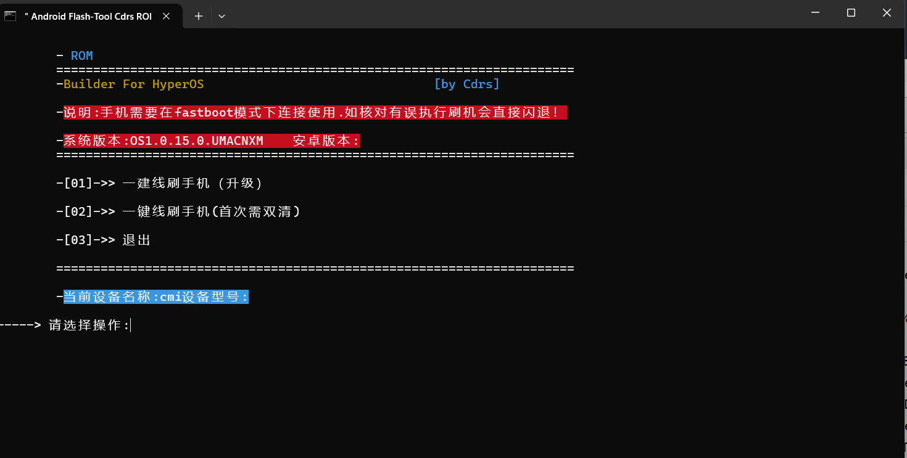

# 目录

- [前言](#start)
  - [机型代号](#device_Code)
- [解锁](#unlock_Bootloader)
- [系统介绍](#sys_introduction)
  - [系统的选择](#select_system)
  - [EXT4与EROFS的区别和内核](#sys_Format)
- [刷机教程](#flash_device)
  - [刷入第三方REC](#flash_rec)
  - [刷入系统](#flash_system)
    - [线刷](#usb_flash)
    - [卡刷](#twrp_flash)
    - [半卡刷-ADB Sideload](#2in1_flash)
- [Root相关](#about_root)
  - [如何root](#how_to_root)
    - [Magisk](#magisk)
    - [KernelSU](#ksu)
    - [Apatch](#apatch)
  - [隐藏root-面具](#hide_root)
    - [MagiskHide](#magiskhide)
    - [Sulist](#sulist)
  - [深度隐藏root的方法](#hide_root_depth)
  - [Magisk和LSP模块的隐藏方法](#other_hide)
  - [关于模块想说的话](#about_modules)
- [备份数据](#backup_data)
- [软件升降级-核心破解](#core_patch)
- [修改软件版本号](#edit_version)
- [官方线刷教程-救砖](#miflash)
- [如何替换基带](#baseband)
- [常见问题](#FAQ)
  - [系统覆盖升降级须知](#system_overlay_update)
  - [NFC 2.0 相关问题](#nfc_2.0)
  - [卡刷显示错误](#twrp_file_error)
  - [提示下载面具](#magisk_download)
  - [掉rec](#mi_rec)
  - [锁屏密码错乱、无法输入，等待目标应用响应等](#waiting_response)
  - [安全管家打不开](#securitycenter_cannot_open)
  - [没有主题壁纸和手机管家图标](#not_found_themestore_and_securitymanager)
  - [momo包管理服务异常](#momo_package_service_exception)
  - [如何校验文件完整性](#check_File)
  - [线刷刷不进去](#usb_cannot_flash)
  - [线刷电脑没反应，无法输入](#unable_to_input)
  - [如何安装ADB](#adb_install)
  - [FTP传输](#use_ftp)
  - [声音不大，音质一般](#sound_effects)
  - [破音，上下声音不一致](#speaker_pa_calibration_test)
  - [Toast弹窗过大](#big_toast)

# <a id="start">前言-你需要知道的一些东西</a>

> ### 此教程面向小米10系列，其他小米设备也可以参考
>
> ### 电脑系统以Windows为主，演示系统：Windows 11 23H2

### <a id="device_Code">机型代号 </a>：

**Mi10：(Umi)**

**Mi10Pro：(Cmi)**

**Mi10/10Pro  2 in 1：(Ucmi)**

**Mi10U：(Cas)**

------

# <a id="unlock_Bootloader">关于解锁</a>

如果您是MIUI系统，直接在电脑上下载小米解锁工具按着官方的步骤来

如果您是澎湃系统，请自行在网上搜索"澎湃解BL锁"解决

若想跳过168小时可以去看看有没有人秒解，当然，这需要钞能力

# <a id="sys_introduction">系统介绍</a>

> ### 主要有安卓13(A13)和安卓14(A14)两大版本
>

## <a id="select_system">系统有什么区别？怎么选？</a>

> ### A13主要是稳定，省电，追求功耗的可选此。
>
> ### A14主要为了满血澎湃，追求澎湃新特性新功能的选此。
>
> ### A13有MIUI14的官改和移植，HyperOS的官改和移植
>
> ### A14只有HyperOS的移植
>
> ### 大部分的移植自动亮度有问题，会出现打开手电筒屏幕亮度拉满的情况

#### Cmi：

- **A13：**

	**MIUI：官改，红米Note13Pro移植，小米13U移植**

	**澎湃：官改，小米12X移植**

- **A14澎湃：小米12SU移植，13U移植，14U移植**

#### Umi/Cas：

- **A13：红米Note13Pro移植MIUI，官改澎湃，小米12X移植澎湃**

- **A14澎湃：小米12SU移植，13U移植，14U移植**

**A13MIUI推荐13u移植和note13p移植，前者丝滑，后者完美没有bug，澎湃推荐12x移植**

**A14的12su相对省电，13u和14u现在功能特性都差不多，14u多了个定位卫星**

**养老就12x移植，14u移植**

如有Carwith等需求且要a13的请选12x移植

目前没有太多新包值得移植，最后打磨完毕后再有任何bug请自行解决或回退版本

带NFC2.0的包可能会导致NFC异常

## <a id="sys_Format">EXT4与EROFS的区别与内核</a>

EXT4使用官方内核，EROFS使用TV的VK内核

EXT4**分区可读写**；EROFS理论上系统更流畅一点**分区只读不可写，修改系统需使用模块挂载**

EXT4官方内核可以和其他支持的内核随意切换，EROFS可以和除官方外其他支持的内核随意切换，**因为官方内核不支持EROFS**

小米10系列官方系统内核为4.19版本，只支持墓碑v1机制，系统墓碑挂载会提示不完整。，而TV大佬的第三方内核可以开启完整的墓碑v2机制，所以使用TV内核。 

想上车内核可以咨询群内管理@The Voyager（酷安同名），有更多新功能使用，并且持续优化调度。

# <a id="flash_device">刷机教程</a>

## <a id="flash_rec">（可选）刷入第三方Recovery（REC）</a>

> ## 绝大部分人选择TWRP作为第三方REC使用，故此教程使用TWRP作为演示，其他REC也可按着此教程操作

### 请先将手机关机，按住电源键和音量下键进入fastboot模式，连接电脑

### 方法一：在群文件或其他地方下载一键刷入TWRP并解压按着提示运行

### 方法二：下载好第三方Recovery用搞机助手等工具刷入

### 方法三：传统命令刷入，接下来的步骤需要使用到fastboot命令，若没配置adb请[点击这里](#adb_install)查看教程

1. 下载第三方Recovery，可以是群里的，也可以是其他地方的，推荐skkk的TWRP，或者去酷安@mi_block的帖子里下载对应机型的REC（[点此跳转](https://www.coolapk.com/feed/45189101?shareKey=ZGEzYzNkOTViNjU5NjZjOWU0NjU~&shareUid=4400238&shareFrom=com.coolapk.market_13.4.1)）

2. 解压出来下载的Recovery.img，查看是否支持boot临时启动，以skkk的TWRP为例

   

   **带有REC标签为只能刷入Recovery分区使用，带有BOOT标签则支持临时启动，同时存在则表示两种方法均可**

3. 打开DOS窗口（Terminal，PowerShell，CMD均可），输入"fastboot devices"查看有没有设备连接

   若显示"< waiting for any device >"或什么都没显示请检查手机是否进入fastboot 模式，尝试安装驱动（群内下载），更换或使用数据线另一面，更换USB 2.0接口

   

   若显示多个设备请断开其他多余的连接，只保留需要刷入的那一个设备

   只有一个设备

4. 若使用临时启动方式，请输入"fastboot boot 路径名\\rec.img"（可将img文件直接拖拽到窗口中）

   回车出现"Finished"字样即为成功，手机会自动打开TWRP，点击"**高级-刷入当前TWRP**"即为刷入完成

5. 刷入Recovery分区，请输入"**fastboot flash recovery 路径名\\rec.img**" 并回车

   若是**VAB设备**，请先输入"fastboot flash recovery_a 路径名\\rec.img" 

   回车后再输入"fastboot flash recovery_b 路径名\\rec.img" 并回车，确保ab两个分区都刷入第三方REC
   最后手动重启或在电脑输入"fastboot reboot recovery"进入Recovery模式

## <a id="flash_system">刷入系统</a>

**前言：此教程为从零开始刷机教程，请根据自己需求选择观看。**

**需要准备：系统包，电脑/手机TWRP。（确定下载的是对应机型，不要下错了！）**

**此教程将说明：线刷/卡刷/半卡刷(ADB Sideload)**

**点此跳转对应刷入方式：**[线刷](#usb_flash)		[卡刷](#twrp_flash)		[半卡刷](#2in1_flash)

**文件名为：Ext4_cmi_Mi10Pro_Cdrs_HyperOS1.0.15.0.UMACNXM(13U移植)_A14_da608.zip**

**分别为：系统格式 机型代号 机型名称 cdrs 系统版本 安卓版本 MD5校验码** 

[系统格式详情点此跳转](#sys_Format)		[机型代号详情点此跳转](#device_Code)

## <a id="usb_flash">线刷</a>

**首先请先检查您的系统包确认是否完整（[如何检查请点这里](#check_File)**）

1. 请先请现在群文件下载USB_Drive驱动并安装

2. 首先要把压缩包解压，并存放在一个位置，**路径中不能有中文和括号，如果有请删除它们**

3. 手机启动到fastboot模式并连接电脑，点击Cdrs一键线刷工具Flash.bat，并根据提示输入数字，最后等待重启即可

   

   **若出现闪退的情况请检查文件是否完整，设备是否上锁**

   **若窗口左上角显示"选择",请按一次回车以继续**

   **若无法输入数字，请检查手机是否进入fastboot模式并接入电脑，是否安装驱动，尝试更换数据线和USB2.0接口**

## <a id="twrp_flash">卡刷</a>

**首先请先检查您的系统包确认是否完整（[如何检查请点这里](#check_File)**）

**以下为第一次刷入所需的步骤**

1. 电脑下载好包 手机进rec，清除-右下角格式化data，输入yes，打✓
2. 等格式化完毕，重启一下rec。 （这操作是为了解密内置储存）
3. rec模式-手机连接电脑，把包复制进内置存储。
4. 刷完返回rec主页，清除-右下角格式化data，输入yes，打✓

**----- 以上为第一次输入所需步骤，以下为后续刷入步骤**

1. 手机下载好rom包，记住下载路径
2. 进入rec主页-安装，找到你记得路径，选择刷机包，滑动刷入，按提示操作
3. 重启开机

**出现一系列挂载失败的红字请无视，重启出现未安装系统请无视**

**只要出现“安装耗时xx秒**”，上方显示**成功**即为刷入成功
安装完成一般如下图所示

## <a id="2in1_flash">半卡刷(ADB Sideload)</a>

**首先请先检查您的系统包确认是否完整（[如何检查请点这里](#check_File)），并且确定已经配置ADB环境([点此查看如何配置](#adb_install))**

1. 手机进入rec界面，点击高级，ADB Sideload，滑动滑块

   

2. 连接电脑，在黑窗口输入"adb sideload 文件完整路径"(**不要解压，直接用zip压缩包**)

3. 回车，剩下的在手机上操作即可

# <a id="about_root">Root相关</a>

## <a id="how_to_root">使用Root的三种方式</a>

> ### 刷入前请进行备份
>

### 系统基于A13及以上的请修补init_boot.img，A12及以下的修补boot.img，此处以boot为例

### 方法一：下载好第三方Recovery用搞机助手等工具刷入

### 方法二：手机在Root环境下使用软件刷入

### 方法三：传统fastboot命令线刷，若没配置adb请[点击这里](#adb_install)查看教程

> #### 线刷指令：fastboot flash boot|boot_a/b|boot_ab boot.img（[刷入方式详见刷入第三方rec](#flash_rec)）

### <a id="magisk">Magisk（面具）</a>

包自带Delta面具(即Kitsune Mask)，想要升降级就修补环境刷入即可

注：最好不要去降级，管理器版本比内核修补版本低并且不完全卸载环境直接降会无法获取甚至卡重启

想刷其他面具版本可以参考：https://magiskcn.com/magisk-change

也可以下载并安装需要的面具，在原面具中把自动响应改为允许并给新面积root权限，最后到新面具修补即可

相关链接：[Magisk原版仓库](https://github.com/topjohnwu/Magisk)		[Kitsune Mask (Delta仓库)](https://github.com/HuskyDG/magisk-files)		[Magisk Alpha仓库](https://install.appcenter.ms/users/vvb2060/apps/magisk/distribution_groups/public)

### <a id="ksu">KernelSU（KSU）</a>

**若使用KSU则原来所有Magisk模块都会被清楚，请自行考虑**

1. 准备支持KSU的内核，并下载安装KSU管理器（[点此跳转](https://github.com/tiann/KernelSU/releases)）
2. 刷入内核即可使用（若设备里有Magisk可以点击卸载Magisk-完全卸载即可）

相关链接&其他安装方法：https://kernelsu.org/zh_CN/guide/what-is-kernelsu.html

### <a id="apatch">Apatch</a>

1. 提取boot.img

2. 打开Apatch，修补boot.img

   

3. 设置超级密钥后点击开始修补

   

4. 刷入修补过的boot.img，存储路径在最下方

   

5. 重启手机，打开Apatch，输入超级密钥，安装系统补丁，完成

## <a id="hide_root">如何隐藏Root-面具</a>

> **狐狸面具不要使用Shimako模块来隐藏root，环境需要修补的一定要修补，不然泄露root**

### <a id="magiskhide">仅使用MagiskHide</a>

在配置MagiskHide中"，给应用打勾是隐藏该应用的root权限

有些软件会出现这种，上方蓝色条只有一部分的情况，这时就需要点击一次勾以外的地方展开它，然后去点复选框才能有一个完全的隐藏

## <a id="sulist">使用SuList</a>

和上方MagiskHide差不多，唯一的区别就是“配置SuList”中打勾的是可使用root权限的

**若配置列表没有应用，请检查读取应用列表权限是否打开**

**有部分软件检测到root，请升级到新版面具**

**若有个别模块或软件（如八达通等app）无法使用，请关掉SuList，使用MagiskHide**

### <a id="hide_root_depth">深度隐藏root的方法（无教程，自行寻找各种模块，只提供思路）</a>

使用其他root管理器，安装zygisk next，shamiko，隐藏bl锁，lsposed 其他版本模块，lsp使用隐藏应用列表

## <a id="other_hide">Magisk和LSP模块的隐藏方法</a>

### 关于发现Magisk

使用面具自带的 "隐藏 Magisk 应用"即可解决

 ### 关于Applist Detector (Ruru) 发现Xposed模块（即LSP模块）的解决办法

#### lsp安装 "隐藏应用列表" 模块，启用并勾选系统框架重启手机

1. 点击模板管理，创建黑名版模板，随便起一个名，点击框中的编辑列表

   

2. 将需要隐藏的应用勾选

   

3. 回到首页，点击应用管理，想对哪个应用隐藏就点哪个应用，以ruru为例

   

   选择启用隐藏，模板设置里勾选刚刚保存的模板，退出，大功告成

# <a id="about_modules">关于模块想说的话</a>

非必要不要刷一些玄学的优化模块，少刷模块别养蛊，**谨防格机模块，谨防格机模块，谨防格机模块，**救砖模块都救不了

# <a id="backup_data">备份数据相关</a>

未root只推荐各大手机品牌自带的换机或备份软件

root了推荐名叫"数据备份"的软件，应用分身也能备份

root了没有空间可以使用"Swift Backup"这款软件，支持FTP，直接把数据传出去

# <a id="core_patch">关于软件升降级 （核心破解）</a>

请在LSPosed或GitHub中安装核心破解，并勾选“系统框架”（[GitHub链接点此跳转](https://github.com/LSPosed/CorePatch)）

然后用mt管理器直接安装

若仍安装失败，请点击模块设置，把里面全勾重启

**注：降级系统软件重启会恢复原来的系统版本，如一定需要降级请自行修改版本号确保高于原软件版本号**

# <a id="edit_version">如何修改软件版本号</a>

以手机管家举例，我们需要修改版本名和版本号，如图所示

点击查看，点击 AndroidManifest.xml，再点击反编译

修改 android:versionCode 和 android:versionName 后面的值，让其大于原来数值即可

点击保存，**不要勾选自动签名**，完成

# <a id="miflash">线刷官方教程-救砖</a>

前期准备：下载官方线刷包（[推荐在此下载](https://xiaomirom.com/)），miflash小米线刷工具包[点此跳转](https://miuiver.com/miflash/)，没有问题的 USB 2.0数据线

1. 将官方线刷包解压到只剩文件夹**（注意存放的路径不能有中文字符和空格，不要放在U盘）**

2. 打开文件夹，编辑flash_all.bat

   

   框选的每一行前面都可以加上" **::** "注释掉，或者直接删除

3. 打开 XiaoMiFlash.exe ，点击左上角Configuration，再点击MiFlash Configuration，将CheckPoint清空

   

   接着点击Driver 安装驱动

   

4. 点击选择，选择系统包那个文件夹点击确定

5. 右下角选择**全部删除！！！全部删除！！！全部删除！！！（上锁了自行解决！！！）**

   

6. **数据线插入 USB 2.0接口，手机进入fastboot模式，点击加载设备，显示设备后确认所有信息无误，是对应机型刷机包，也选的全部删除不是lock！全部确认完毕点击刷机并等待**

   

   

## 其他问题

若出现了 "Missmatching image and device error"或下方图片第一行样式长时间不动，请检查系统包与设备机型是否一致，确认无误的话编辑 flash_all.bat ，将下方框选的命令使用 " :: "注释掉或直接删除

### 更多问题可在miuiver 找到答案

线刷指南（[点此跳转](https://miuiver.com/how-to-flash-xiaomi-phone/)）		

线刷报错问题及解决方法（[点此跳转](https://miuiver.com/miflash-problem-list/)）

# <a id="baseband">如何替换基带</a>

**注意！请备份原基带！无论是多系统工具箱备份字库还是复制大法，请务必备份，推荐备份字库！请确保基带可在本机使用！** 

1. mt管理器进入/vendor/firmware_mnt/image/（没有备份请先备份！） 

2. 打开飞行模式，将下载好的基带文件替换进去 

3. 关闭飞行等一段时间（30秒），有信号了重启两次（其实一次就行，不知道为什么都说两次） 
    受当地网络环境和运营商的影响，请自行寻找合适的基带，请确保基带可在本机使用，请务必备份数据！

  **推荐多系统工具箱备份整个字库！** 

# <a id="FAQ">常见问题</a>

## <a id="system_overlay_update">系统覆盖升降级须知</a>

若想覆盖系统包，需要检查安卓补丁，如果补丁日期相同或更新可以直接覆盖升级

若补丁日期比当前系统旧，覆盖后删除以下文件即可解决大部分问题

/data/dalvik-cache/ 

/data/system/package_cache/ 

/data/system/locksettings.db 

## <a id="nfc_2.0">NFC2.0 相关问题</a>

关于掉NFC2.0和部分设备的NFC可能在设置刷卡城市后失效，
进第三方rec文件管理中或者使用Mt管理器

/data/nfc删除

/data/vendor/nfc删除

/data/misc/nfc删除

/data/system/package_cache/删除里面的垃圾缓存文件夹

重启系统就好了

## <a id="twrp_file_error">刷入系统或内核显示错误</a>

请校验文件并重新下载，出现错误字样一般是文件不完整导致的，很少一部分情况是TWRP版本问题

## <a id="magisk_download">它为什么要下载重新下载面具</a>

刷机后首次打开面具提示修复运行环境重启手机会出现掉面具图标和下载转圈问题（如下图）

自行下载面具apk安装一下即可，可在群文件下载，或者去官方仓库下载

## <a id="mi_rec">为什么我的rec没了</a>

刷机时选择不root并且为官方内核会掉twrp，变成官方rec，请提前备份重新刷入rec，或者使用修改过的boot

## <a id="waiting_response">锁屏密码错乱、无法输入，等待目标应用响应等</a>

进rec或者mt管理器:/data/system/locksettings.db删除这个文件，然后重启。 
手机这种情况多半是安全补丁变旧的锅

## 不双清刷机之后如果出现某个软件闪退，打不开，出错等问题 

进rec或mt管理器：/data/system/package_cache/
删除这个文件夹，然后重启手机。 
rec（twrp）需点击高级-文件管理方可操作 

## 刷机后进桌面：卡重启、打开应用无响应等一切问题

rec主页-高级-文件管理删除以下文件即可 
/data/dalvik-cache/ 
/data/system/package_cache/ 
/data/system/locksettings.db 
/data/system/locksettings.db-journal 

## <a id="securitycenter_cannot_open">安全管家打不开</a>

尝试清除安全服务全部数据，重新安装，mt管理器删除/data/system/package_cache/这个文件夹后重启

## <a id="not_found_themestore_and_securitymanager">没有主题壁纸和手机管家图标</a>

mt管理器进
/product/data-app/MIUISecurityManager/
/product/data-app/MIUIThemeStore/
手动安装一下即可

## <a id="momo_package_service_exception">momo包管理服务异常</a>

把核心破解中下图开关关掉就解决

## <a id="check_File">如何校验文件完整性</a>

**在刷机或进行重要且有风险的操作之前，我们建议先校验文件确保其完整性**

以文件名为 <u>[REC_BOOT]3.7.1_12-Mi10Pro_FBEv2_v8.6_A14-cmi-skkk_9d23a457.zip</u> 的文件为例

其中<u>9d23a457</u>为校验码，得到这串字符后我们便可去进行文件的校验和比对

#### 校验使用的操作系统（点击跳转）：[Windwos](#windows_Check)	[Android](#android_Check)	[Linux](#linux_Check)

-----

### <a id="windows_Check">Windows</a>

打开cmd，输入"**certutil -hashfile <文件名称(绝对路径)> MD5**"，回车即可校验

红色框选处为命令，绿色即为得到的结果，将结果与文件对比，**数值完全一致即为完整，数值不一样则需要重新下载**

### <a id="android_Check">Android</a>

以MT管理器为例，**长按文件，依次点击属性-校验，比对md5是否与文件一致，不一致请重新下载后再次比对**

### <a id="linux_Check">Linux</a>

输入md5sum 文件名，回车即可

## <a id="usb_cannot_flash">为什么线刷刷不进去</a>

请排查您的问题，USB_Driver驱动有没有安装，是否为USB2.0数据线和接口，系统文件是否完整

## <a id="unable_to_input">为什么线刷电脑没反应，无法输入</a>

请将手机进入fastboot模式并连接电脑

## <a id="adb_install">如何安装ADB</a>

1. [点此跳转到下载界面并下载对应系统的 Platform-Tools 工具包](https://developer.android.google.cn/tools/releases/platform-tools?hl=zh-cn#downloads)

2. 将下载好的压缩包解压出来，存放位置和命名随意，但请注意**不能删除或修改这个路径里的任意文件夹或文件**例如我存放在了"C:\D\develop\ADB\\"

   这个目录**此后这个路径和文件夹不能进行任何更改，否则按照接下来的步骤重新配置**

3. 打开这个文件夹并在顶部把路径**复制**下来

   

4. 按下Win键，在搜索栏输入"环境变量"打开或者依次打开"设置-系统信息-高级系统设置"，再点击环境变量，在**系统变量**中找到Path并双击打开

   

5. 点击"新建按钮"或点击下方空白栏，**将复制的路径粘贴进去，并一路点击确定**

6. 最后使用**Win+R键输入"cmd"回车**，在黑窗口输入**"adb version"**，若出现版本号即为成功配置

## <a id="use_ftp">FTP传输</a>

1. 手机在文件管理点击右上角，选择远程管理

2. 再点击右上角来到远程管理的设置界面

​	匿名登录关闭则需要输入用户名和密码，反之打开则不需要

3. 返回上一级

4. 点击启动服务

   

   手机以mt管理器举例

   

5. 点击三个点，选择添加网络存储，FTP

   

   主机填写上方"ftp://后面的IP地址"，端口填写上方" : "后面的数字

   设置了用户名和密码就输入进去，编码确认和上方传输编码一致，否则显示乱码

6. 点击测试，显示测试成功保存即可，这时就能看见网络一栏多了个地址，点击即可连接

Windows在此电脑上方地址栏输入蓝字即可

## <a id="sound_effects">声音不大，音质一般</a>

请将音质音效里的场景选择切换为人声

## <a id="speaker_pa_calibration_test">破音，上下声音不一致</a>

点五次内核版本或者拨号盘输入*# *#6484# *# *进入cit

点击右上角，辅助工具，扬声器功放校准测试

## <a id="big_toast">Toast弹窗过大</a>

解决方法：四清输入系统

 

 

Author: 123nhh🍥

<del>shiyun177🍥</del>

Date: 2024/10/21

